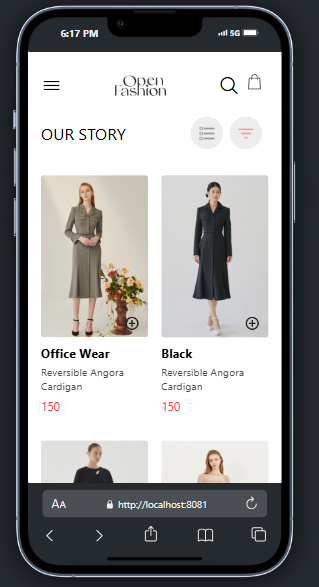
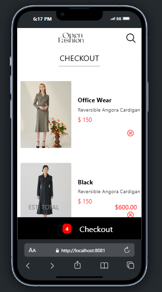

# rn-assignment6-11285447

# React Native E-commerce UI App

This project is an assignment for the DCIT202 Mobile Application Development course. The objective is to develop a mobile application that enables users to view a list of products, add products to their cart, remove products from their cart, and view the items in their cart. The application employs local storage to save selected items on the device.

## Table of Contents

- Features

- Components
  - HomeScreen
  - CartScreen
  - ProductCard
  - CartItem
  - AsyncStorage Implementation

- Functionality

- Live Demo

- Screenshots

- ## Installation
  - Prerequisites

- Usage

- Contributing

- License

## Features

- **Display products**: Products are displayed in a grid layout on the Home screen.
- **Navigation**: Users can navigate to the Checkout screen from the Home screen.
- **Cart Summary**: The Checkout screen shows the list of selected products and their total cost.
- **Bottom Tab Navigation**: For easy access to the Checkout screen.
- **Persistent Storage**: Utilizes AsyncStorage to store selected items locally on the device.
  - Products added to the cart are stored persistently using AsyncStorage.
  - Upon app restart, previously selected items are retrieved from AsyncStorage and displayed in the CartScreen.

## Functionality

The application provides the following features:
- Users can view a list of available products.
- Add products to their cart.
- Remove products from their cart.
- View the items in their cart.

## Screenshots

- **Home Screen**
  - Home screen


- **Checkout Screen**
  - Checkout screen


## Installation

1. **Clone the repository**:
   ```sh
   git clone https://github.com/Marks-Spencer20/rn-assignment6-11285447.git
   cd MarkApp
   ```
   
2. **Install the dependencies**:
   ```sh
   npm install
   ```

3. **Start the Expo server**:
   ```sh
   npm start
   ```

## Usage

1. **Run the app on an Android or iOS device**:
   - Use the Expo Go app to scan the QR code displayed in your terminal.

2. **Explore the app**:
   - Browse products on the Home screen.
   - Navigate to the Checkout screen to view the selected products and their total cost.

## Live Demo

- https://vimeo.com/974407464?share=copy

## Contributing

Contributions are welcome! Please feel free to submit a Pull Request.

## License

This project is licensed under the MIT License.

## Additional Information

- This project was developed using React Native (Expo) version X.X.X.
- Tested on iOS and Android simulators/emulators.

- **Credits**: Developed by Javis Frimpong.
